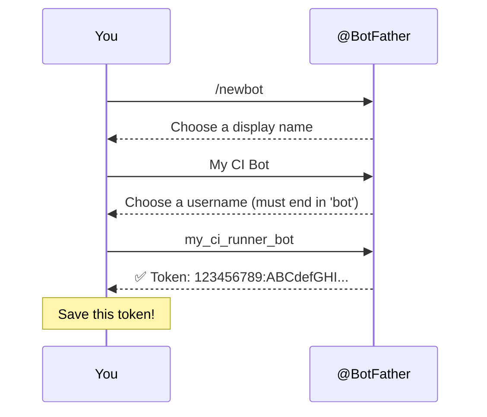
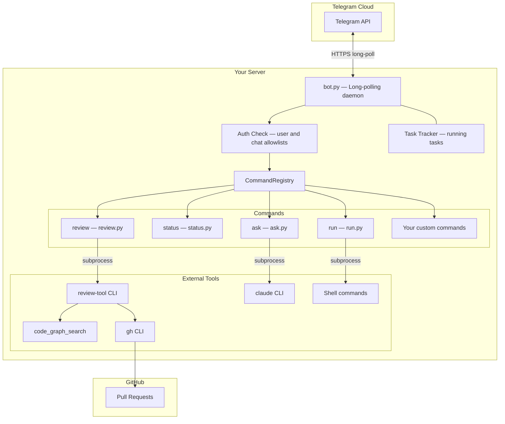
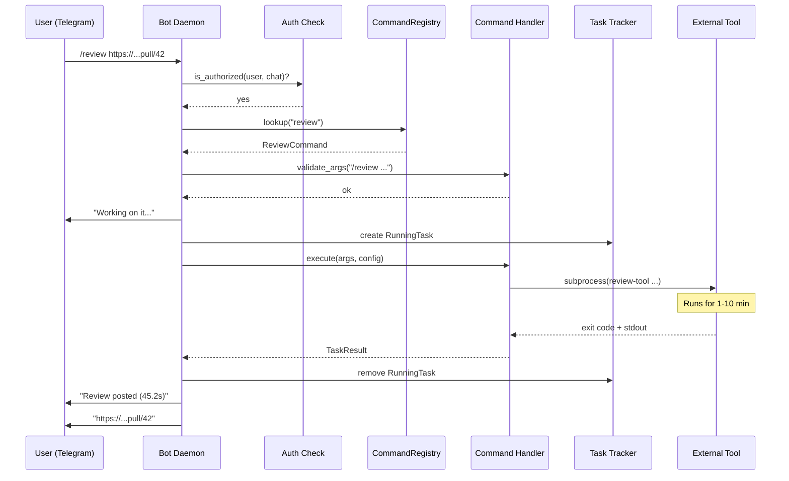
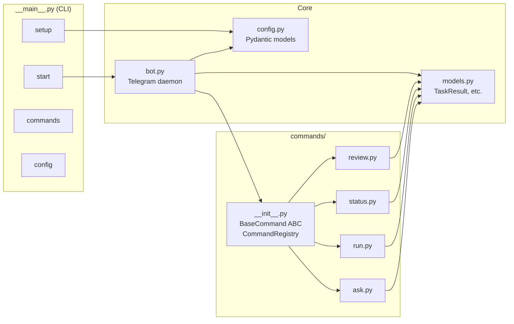
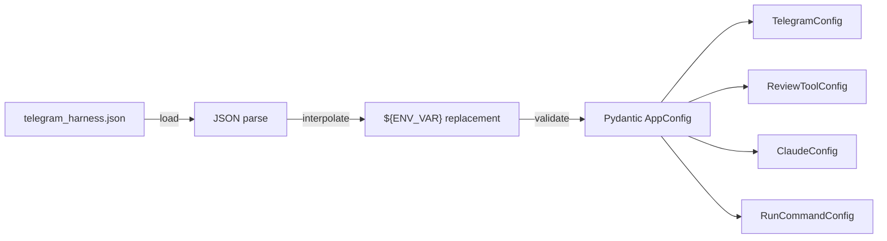
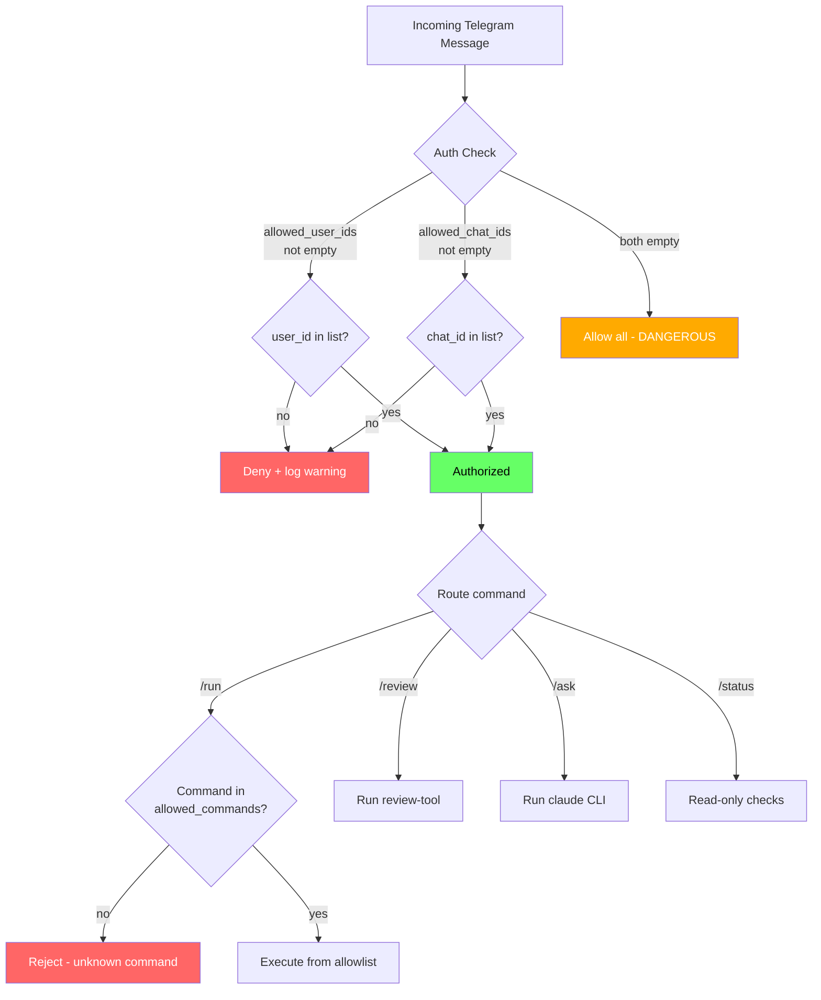
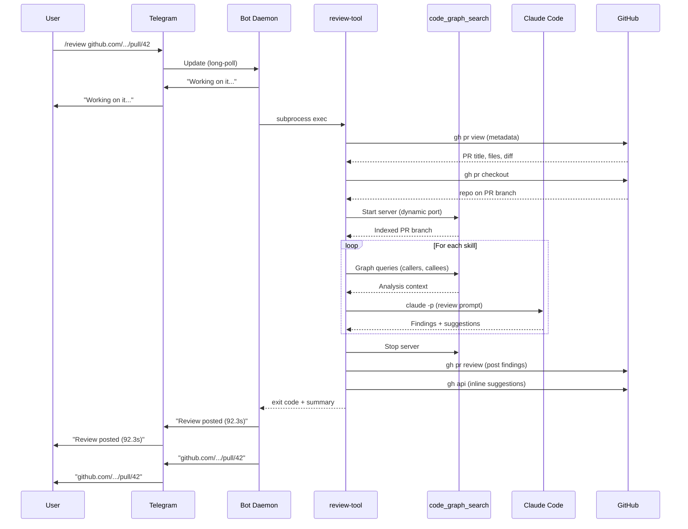
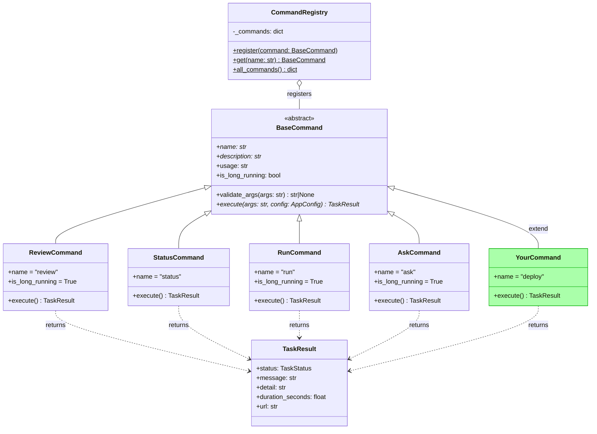
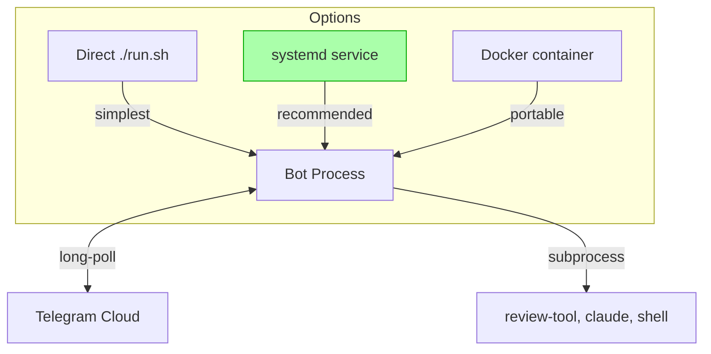
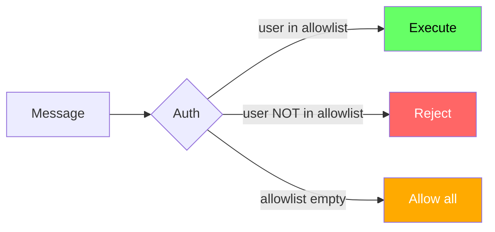

# telegram-harness

Extensible Telegram bot that lets you run commands remotely from your phone. Send a message to your bot and it executes tasks on your server — AI code reviews, shell commands, system health checks, or questions to Claude — and replies with the results.

## Features

- **Remote PR reviews** — `/review <pr-url>` triggers an AI code review and posts it to GitHub
- **System health** — `/status` checks disk, tool availability, and service health
- **Shell commands** — `/run <name>` executes commands from a configurable allowlist
- **Ask Claude** — `/ask <question>` sends a question to Claude Code CLI and returns the answer
- **Background tasks** — long-running commands execute asynchronously; `/tasks` shows what's running
- **Access control** — restrict the bot to specific Telegram user IDs or chat IDs
- **Extensible** — add new commands by subclassing `BaseCommand`

---

## Table of Contents

- [Quick Start](#quick-start)
- [Telegram Bot Setup (Step by Step)](#telegram-bot-setup-step-by-step)
- [Installation](#installation)
- [Configuration](#configuration)
- [Commands](#commands)
- [Architecture](#architecture)
- [Extending — Writing Custom Commands](#extending--writing-custom-commands)
- [Deployment](#deployment)
- [Security](#security)

---

## Quick Start

```bash
# 1. Clone and install
git clone git@github.com:geekychris/telegram_runner.git
cd telegram_runner
./run.sh setup

# 2. Run the interactive setup wizard
telegram-harness setup

# 3. Start the bot
./run.sh
```

Or in three commands if you already have a bot token:

```bash
./run.sh setup
export TELEGRAM_BOT_TOKEN=123456789:ABCdefGHIjklMNOpqrSTUvwxYZ
./run.sh
```

---

## Telegram Bot Setup (Step by Step)

### 1. Create the Bot



1. Open Telegram on your phone or desktop
2. Search for **@BotFather** (the official Telegram bot for creating bots)
3. Send: `/newbot`
4. BotFather asks for a **display name** — choose anything (e.g., "My CI Bot")
5. BotFather asks for a **username** — must end in `bot` (e.g., `my_ci_runner_bot`)
6. BotFather replies with your **API token**:
   ```
   123456789:ABCdefGHIjklMNOpqrSTUvwxYZ
   ```
   Save this token — it's your `TELEGRAM_BOT_TOKEN`.

### 2. Find Your User ID (for Access Control)

To restrict the bot so only you can use it:

1. Search for **@userinfobot** on Telegram
2. Send it any message
3. It replies with your user ID (a number like `123456789`)

Alternatively, use **@getidsbot** — forward any message to it and it shows the user/chat ID.

### 3. Run the Setup Wizard

The interactive wizard handles everything:

```bash
telegram-harness setup
```

It will:
- Ask you to paste the bot token (or set it later via env var)
- Ask for your user ID to lock down access
- Detect the `review-tool` CLI path
- Generate a config file
- Verify the bot token works by calling the Telegram API

### 4. Set Bot Commands in BotFather (Optional)

To get a nice command menu in Telegram, tell BotFather about your commands:

1. Message **@BotFather**
2. Send: `/setcommands`
3. Select your bot
4. Paste this:
   ```
   review - Run AI code review on a GitHub PR
   status - Check system health and services
   run - Execute a predefined shell command
   ask - Ask Claude a question
   help - Show available commands
   tasks - Show running background tasks
   ```

Now when users type `/` in your bot's chat, they see the command menu.

### 5. Start the Bot

```bash
export TELEGRAM_BOT_TOKEN=123456789:ABCdefGHIjklMNOpqrSTUvwxYZ
./run.sh
```

Open Telegram, find your bot, and send `/help`.

---

## Installation

### Prerequisites

| Tool | Required | Install |
|------|----------|---------|
| Python 3.11+ | Yes | `brew install python` |
| review-tool | For `/review` | [review_tool repo](https://github.com/geekychris/Claude-based-PR-AI-Review-tool-for-github) |
| claude CLI | For `/ask` | `npm install -g @anthropic-ai/claude-code` |
| gh CLI | For `/review` | `brew install gh` |

### Install via Script

```bash
./run.sh setup
```

### Install Manually

```bash
python3 -m venv .venv
source .venv/bin/activate
pip install -e .
telegram-harness config init
```

---

## Configuration

Configuration is a JSON file (default: `telegram_harness.json`) with `${ENV_VAR}` interpolation.

### Generate Default Config

```bash
telegram-harness config init
```

### Full Configuration Reference

```json
{
  "telegram": {
    "bot_token": "${TELEGRAM_BOT_TOKEN}",
    "allowed_chat_ids": [],
    "allowed_user_ids": []
  },
  "review_tool": {
    "enabled": true,
    "review_tool_path": "review-tool",
    "default_args": ["--config", "/path/to/review_tool.json"]
  },
  "claude": {
    "enabled": true,
    "model": "sonnet",
    "max_budget_usd": 0.50
  },
  "run_commands": {
    "enabled": true,
    "allowed_commands": {
      "deploy-staging": "cd /app && git pull && make deploy-staging",
      "run-tests": "cd /app && make test",
      "disk-usage": "df -h",
      "git-status": "cd /app && git status && git log --oneline -5"
    }
  },
  "work_dir": "/tmp/telegram_harness"
}
```

| Section | Key | Description |
|---------|-----|-------------|
| `telegram.bot_token` | Bot API token from @BotFather. Use `${TELEGRAM_BOT_TOKEN}` for env var. |
| `telegram.allowed_chat_ids` | List of chat IDs that can use the bot. Empty = allow all. |
| `telegram.allowed_user_ids` | List of user IDs that can use the bot. Empty = allow all. |
| `review_tool.review_tool_path` | Path to `review-tool` CLI binary. |
| `review_tool.default_args` | Extra args passed to every review invocation. |
| `claude.model` | Claude model for `/ask` (sonnet, opus, haiku). |
| `claude.max_budget_usd` | Max spend per `/ask` invocation. |
| `run_commands.allowed_commands` | Map of name -> shell command. Only these can be executed via `/run`. |

### Environment Variable Interpolation

```json
{
  "telegram": {
    "bot_token": "${TELEGRAM_BOT_TOKEN}"
  }
}
```

- `${VAR}` — replaced with env var value, or empty if unset
- `${VAR:-default}` — replaced with env var value, or `default` if unset

---

## Commands

### `/review <pr-url> [options]`

Run an AI code review on a GitHub pull request.

```
/review https://github.com/owner/repo/pull/42
/review https://github.com/owner/repo/pull/42 --skills security,defects
/review https://github.com/owner/repo/pull/42 --dry-run -v 2
```

The bot:
1. Sends "Working on it..." immediately
2. Invokes `review-tool review <pr-url>` as a subprocess
3. Waits for completion (up to 15 minutes)
4. Replies with the result summary and a link to the PR

Options are passed through to `review-tool`.

### `/status`

Check system health: disk space, Python version, availability of tools (review-tool, gh, claude, java), and whether code_graph_search is running.

```
/status
```

### `/run <name> [args]`

Execute a predefined shell command from the allowlist in config.

```
/run list              — show available commands
/run deploy-staging    — execute the deploy-staging command
/run disk-usage        — check disk space
/run git-status        — check git status of the app
```

Commands are defined in `run_commands.allowed_commands` in config. No arbitrary shell execution is allowed — only commands explicitly listed in the config can be run.

If the command template contains `{args}`, the user's arguments are substituted in. Otherwise, args are appended.

### `/ask <question>`

Send a question to Claude Code CLI and get an answer back.

```
/ask What does the auth middleware do in this project?
/ask Explain the difference between merge and rebase
/ask Write a Python function to calculate fibonacci numbers
```

Uses `claude -p` in headless mode. Configurable model and budget.

### `/help`

List all available commands with descriptions.

### `/tasks`

Show currently running background tasks (commands that haven't finished yet).

---

## Architecture

### System Overview



### Command Execution Flow



### Module Structure



### Config Loading



### Security Model



### Review Command — End-to-End Flow



### Extension Point — Adding a Command



### Module Overview

```
src/telegram_harness/
├── __main__.py          CLI entry point (start, commands, config, setup)
├── bot.py               Telegram bot daemon — auth, routing, task tracking, replies
├── config.py            Pydantic config with ${ENV_VAR} interpolation
├── models.py            TaskResult, RunningTask, TaskStatus
└── commands/
    ├── __init__.py      BaseCommand ABC + CommandRegistry
    ├── review.py        /review — invokes review-tool CLI
    ├── status.py        /status — system health checks
    ├── run.py           /run — predefined shell commands
    └── ask.py           /ask — Claude Code CLI questions
```

---

## Extending — Writing Custom Commands

### Step 1: Create a Command Module

Create a new file in `src/telegram_harness/commands/`:

```python
# src/telegram_harness/commands/deploy.py
"""Deploy command — trigger deployment to an environment."""

from __future__ import annotations

import asyncio
from telegram_harness.commands import BaseCommand, CommandRegistry
from telegram_harness.config import AppConfig
from telegram_harness.models import TaskResult, TaskStatus


class DeployCommand(BaseCommand):
    @property
    def name(self) -> str:
        return "deploy"

    @property
    def description(self) -> str:
        return "Deploy to an environment (staging or production)"

    @property
    def usage(self) -> str:
        return "/deploy <staging|production>"

    @property
    def is_long_running(self) -> bool:
        return True

    def validate_args(self, args: str) -> str | None:
        if args.strip() not in ("staging", "production"):
            return "Usage: /deploy <staging|production>"
        return None

    async def execute(self, args: str, config: AppConfig) -> TaskResult:
        env = args.strip()

        proc = await asyncio.create_subprocess_shell(
            f"cd /app && make deploy-{env}",
            stdout=asyncio.subprocess.PIPE,
            stderr=asyncio.subprocess.STDOUT,
        )
        stdout, _ = await proc.communicate()
        output = stdout.decode() if stdout else ""

        if proc.returncode == 0:
            return TaskResult(
                status=TaskStatus.COMPLETED,
                message=f"Deployed to {env} successfully!",
                detail=output[:3000],
                url=f"https://{env}.example.com",
            )
        else:
            return TaskResult(
                status=TaskStatus.FAILED,
                message=f"Deploy to {env} failed (exit {proc.returncode})",
                detail=output[:3000],
            )


CommandRegistry.register(DeployCommand())
```

### Step 2: Register the Import

Add one line to `src/telegram_harness/commands/__init__.py`:

```python
from telegram_harness.commands import deploy as _deploy  # noqa: F401, E402
```

### Step 3: Done

The command is automatically available as `/deploy` in Telegram. No other changes needed.

### BaseCommand API Reference

| Method/Property | Required | Description |
|----------------|----------|-------------|
| `name` | Yes | Command name, used as `/name` in Telegram |
| `description` | Yes | One-line description shown in `/help` |
| `usage` | No | Usage string shown on bad args. Default: `/{name}` |
| `is_long_running` | No | If `True`, bot sends "working on it" before executing. Default: `False` |
| `validate_args(args)` | No | Return error string or `None`. Called before execute. |
| `execute(args, config)` | Yes | Async method. Return `TaskResult`. |

### TaskResult Fields

| Field | Type | Description |
|-------|------|-------------|
| `status` | `TaskStatus` | `COMPLETED` or `FAILED` |
| `message` | `str` | Short summary sent as the reply |
| `detail` | `str` | Full output (sent as code block, truncated to 4000 chars) |
| `duration_seconds` | `float` | Execution time (shown in reply) |
| `url` | `str` | Optional link (sent as a separate message) |

---

## Deployment

### Deployment Options



### Run Directly

```bash
export TELEGRAM_BOT_TOKEN=your-token
./run.sh
```

### Run as systemd Service

Create `/etc/systemd/system/telegram-harness.service`:

```ini
[Unit]
Description=Telegram Harness Bot
After=network.target

[Service]
Type=simple
User=deploy
WorkingDirectory=/opt/telegram-harness
Environment=TELEGRAM_BOT_TOKEN=your-token
Environment=GH_TOKEN=your-github-token
ExecStart=/opt/telegram-harness/.venv/bin/telegram-harness start -c /opt/telegram-harness/telegram_harness.json
Restart=on-failure
RestartSec=10

[Install]
WantedBy=multi-user.target
```

```bash
sudo systemctl enable telegram-harness
sudo systemctl start telegram-harness
sudo journalctl -u telegram-harness -f  # view logs
```

### Run in Docker

```dockerfile
FROM python:3.12-slim

RUN apt-get update && apt-get install -y git curl && rm -rf /var/lib/apt/lists/*

# Install gh CLI
RUN curl -fsSL https://cli.github.com/packages/githubcli-archive-keyring.gpg \
    | dd of=/usr/share/keyrings/githubcli-archive-keyring.gpg \
    && echo "deb [arch=$(dpkg --print-architecture) signed-by=/usr/share/keyrings/githubcli-archive-keyring.gpg] https://cli.github.com/packages stable main" \
    > /etc/apt/sources.list.d/github-cli.list \
    && apt-get update && apt-get install -y gh && rm -rf /var/lib/apt/lists/*

# Install Node.js + Claude CLI
RUN curl -fsSL https://deb.nodesource.com/setup_22.x | bash - \
    && apt-get install -y nodejs && npm install -g @anthropic-ai/claude-code

WORKDIR /app
COPY . .
RUN pip install --no-cache-dir .

CMD ["telegram-harness", "start", "-c", "/config/telegram_harness.json"]
```

```bash
docker build -t telegram-harness .
docker run -d \
  -e TELEGRAM_BOT_TOKEN=$TELEGRAM_BOT_TOKEN \
  -e GH_TOKEN=$GH_TOKEN \
  -v $(pwd)/telegram_harness.json:/config/telegram_harness.json:ro \
  -v ~/.claude:/root/.claude:ro \
  telegram-harness
```

---

## Security

### Access Control



**Always configure access restrictions in production:**

```json
{
  "telegram": {
    "allowed_user_ids": [123456789],
    "allowed_chat_ids": [987654321]
  }
}
```

- `allowed_user_ids` — only these Telegram users can send commands
- `allowed_chat_ids` — only these chats (DMs or groups) are accepted
- If both are empty, **anyone** who finds your bot can use it

### Shell Command Allowlist

The `/run` command can **only** execute commands explicitly listed in config:

```json
{
  "run_commands": {
    "allowed_commands": {
      "disk-usage": "df -h",
      "deploy-staging": "cd /app && make deploy-staging"
    }
  }
}
```

There is no way to execute arbitrary shell commands via the bot. Adding a new command requires editing the config file.

### Token Security

- Never commit `TELEGRAM_BOT_TOKEN` or `GH_TOKEN` to the repo
- Use environment variables or a config file outside the repo
- The `.gitignore` excludes `telegram_harness.json` and `.env`

### Recommendations

- Set `allowed_user_ids` to your Telegram user ID
- Use a dedicated GitHub token with minimal scopes for the review tool
- Run the bot as a non-root user in production
- Use the setup wizard (`telegram-harness setup`) which prompts for security config
